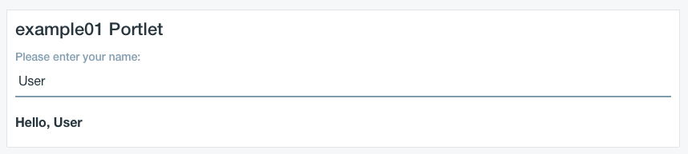

# Developing Liferay 7 portlets with Vue.js, Webpack and hot code replace

## Intro

TODO some intro words about Liferay

While [Liferay 7](TODO) does offer its own reactive frontend development
framework in [Metal JS](TODO), many developers may be eager to use a more
established or more familiar framework like [Vue.js](TODO), [React](TODO) or
some flavor of [Angular](TODO). Out of the box there is not much support for
using these frameworks with Liferay, but with a bit of configuration it is
possible to use them with a suprisingly high level of comfort and have them
integrate relatively elegantly into the Liferay development environment.

The level of comfort and integration I'm talking about should fulfill the
following requirements:
  * The JavaScript libraries should integrate well with Liferay's own managed JS
	module system
  * The frontend build tools, including `node`, `npm` and `webpack` should
	integrate well with Liferay's build system
  * Code reuse should be possible in multiple portlet modules and should prevent
	double- or multiple-inclusion of JS libraries in a page when there are
	multiple or no portlets using them
  * We should be able to use ES2015, JSX or Vue.js's single-file components
  * Hot updating of JavaScript code should work, so that changes are immediately
	visible on a page without a module redeploy (or even a page reload)
  * Other debugging tools provided by Webpack, including source maps, should
	work as well

We will achieve all this and more in what follows. I've decided to use Vue.js
for this guide, but similar steps should work with any other framework.

Working code is available on [GitHub](TODO).

## Preparation

To follow this guide, you should have [Blade CLI
tools](https://dev.liferay.com/develop/tutorials/-/knowledge_base/7-0/installing-liferay-workspace)
installed, and then use them to initialize a Liferay workspace with a working
Liferay 7 instance.

## Integrating Vue.js into Liferay's JavaScript module system

There's a few steps involved when integrating a JavaScript library for use with
Liferay.  You don't simply include a link to some script resource somewhere.
Where would you include it? In the portlet markup? Theme markup? These wouldn't
work well for a variety of reasons, e.g. you couldn't prevent multiple or
unneccessary inclusion.

This is why Liferay has a system that actively manages JavaScript modules on
both server and frontend side. You package a JS library as a OSGi bundle along
with some Liferay-specific configuration files. Liferay's runtime then detects
JS modules and makes them available on the frontend through respective API-s.

Liferay's module system is based on the
[AMD](http://requirejs.org/docs/whyamd.html) specification (there is also a
legacy YUI-based module system present). This means that any AMD-compatible JS
library, including Vue.js, will work unmodified with it.

To supply the Liferay frontend with Vue.js, we will create a new Liferay 7 web
module, `vuejs-web`. This module will contain only a single JavaScript
configuration file, but its build script will be configured to download Vue.js
and wrap it up as a web resource.

	$ blade create vuejs-web
	Created the project vuejs-web using the mvc-portlet template in (...)/modules
	$ cd modules/vuejs-web/
	$ rm -rf src/main/java src/main/resources/META-INF/resources/*.jsp

The `build.gradle` script will download a version of Vue.js via webjars, extract
the packaged JS file (dev or prod version, depending on a Gradle project
property) and place it in the `build/js` directory:

`build.gradle`:

```gradle
buildscript {
	repositories {
		maven {
			url "https://cdn.lfrs.sl/repository.liferay.com/nexus/content/groups/public"
		}
	}
	dependencies {
		classpath group: "com.liferay", name: "com.liferay.gradle.util", version: "latest.release"
		classpath group: "com.liferay", name: "com.liferay.gradle.plugins.node", version: "latest.release"
	}
}

import com.liferay.gradle.util.copy.StripPathSegmentsAction
import com.liferay.gradle.plugins.node.tasks.ExecuteNodeTask

boolean isProd = project.hasProperty("prod")

configurations {
	vue
}

task buildVue(type: Copy)
String vueVersion = "2.4.2"
File jsDestinationDir = file("build/js")

buildVue {
	eachFile new StripPathSegmentsAction(6)
	from {
		zipTree(configurations.vue.singleFile)
	}
	String vueFile = isProd ? "vue.min.js" : "vue.js"
	include "META-INF/resources/webjars/vue/${vueVersion}/dist/${vueFile}"
	includeEmptyDirs = false
	rename("vue\\.min\\.js", "vue.js")
	into new File(jsDestinationDir, "vue")
}

classes {
	dependsOn buildVue
}

dependencies {
	vue group: "org.webjars.npm", name: "vue", transitive: false, version: vueVersion
}
```

The module's `bnd.bnd` file contains the next important bit, the
`Liferay-JS-Config` property, which will ensure that Liferay recognizes this
module as a provider of JS resources. Also, it contains an -includeresource
directive which makes sure our downloaded JS file gets packaged inside the
module jar.

`bnd.bnd`:

```
Bundle-SymbolicName: vuejs-web
Bundle-Version: 2.4.2
-includeresource: META-INF/resources/js=build/js
Liferay-JS-Config: /META-INF/resources/js/config.js
Web-ContextPath: /vuejs-web
```

What remains is to add the `config.js` file referenced by the
`Liferay-JS-Config` property. This JavaScript file registers our JS module with
the frontend module runtime.

`src/main/resources/META-INF/resources/js/config.js`:

```javascript
Loader.addModule({
    dependencies: [],
    name: 'vue',
    path: MODULE_PATH + '/js/vue/vue.js'
})
```

The module is now ready for deployment. Make sure your Liferay instance is
started and run:

	$ blade gw deploy

There. Vue.js is ready to be used within a portlet.

## Adding a simple portlet that uses Vue.js

We will now create a portlet that uses Vue.js in the simplest possible way: by
using markup inside a `.jsp` file as a template for the Vue.js instance.

	$ cd ..
	$ blade create example01
	$ cd example01

By default, a MVC portlet is created. We will edit only the `view.jsp` file:

`src/main/resources/META-INF/resources/view.jsp`:

```jsp
<%@ include file="/init.jsp" %>

<div id="<portlet:namespace/>example01">
    <div class="form-group">
        <label>Please enter your name:</label>
        <input class="form-control" type="text" v-model="name">
    </div>
    <p>
        <b>Hello, {{ name }}</b>
    </p>
</div>

<aui:script require="vue">
new vue({
	el: '#<portlet:namespace/>example01',
    data: {
		name: 'User'
	}
})
</aui:script>
```

The `require="vue"` attribute of the `<aui:script/>` tag loads the `vue` AMD
module and makes it available inside the tag as a variable named `vue`. The name
is in lower case because Liferay maps module names into lowercase-starting camel
case (so `my-lib` becomes `myLib`).

If we deploy the portlet and add it to a page, this should be the result:



This method of integrating Vue into Liferay is sufficient for some scenarios,
e.g. when the functionality is simple or we are adding some simple dynamic
frontend logic to existing portlets. However, it lacks code reusability and it
doesn't support the very practical [Vue single file
components](https://vuejs.org/v2/guide/single-file-components.html). We will
enable those next.

## Packaging the Vue app using Webpack

[Webpack](https://webpack.js.org) is a widely used tool for bundling JavaScript
modules into a single Javascript file. It can also translate various other files
into cross-browser JavaScript, two of which are interesting for our case: ES2015
and Vue single file components.

Webpack is a [node.js](nodejs.org)-based tool which uses [npm](www.npmjs.com)
and many third-party plugins to do its work. Liferay build tooling already has
support for both, and we are going to reuse it here. The tooling even
automatically downloads node and npm for the local platform, so local
instalation of node.js is not strictly neccessarry.

We'll start with a new portlet module project:

	$ cd ..
	$ blade create example02
	$ cd example02

The plan is to use Webpack to generate a packaged module called `example02`
which would contain all the custom components and functionality needed for the
portlet, along with any third-party libraries we may need, and to register it as
a Liferay JS Module to be used inside the portlet.

We will not, however, bundle a version of Vue.js inside this packaged module; we
will use the one provided by the previously built `vuejs-web` module via
Liferay's module loader. This way we will prevent multiple packaging and loading
of the Vue runtime, gaining some efficiency when Vue.js is used by multiple
portlets on a page. This may not always be preferrable, and it's easy to package
Vue.js with the portlet if it better fits your constraints.

So, let's prepare the example02 module first. We'll use `main.js` as the module
entry point:

`src/main/resources/META-INF/resources/js/main.js`:

```javascript

```

We'll extract the template from example01 as a Vue component:

`src/main/resources/META-INF/resources/js/Example02.vue`:

```html
```

The `view.jsp` file is much simpler now:

`src/main/resources/META-INF/resources/view.jsp`:

```jsp
```

That'is it for the portlet functionality! Now we just need the scaffolding for
the actual build.

First we need to prepare the `package.json` file to declare node package
dependencies needed for Webpack:

`package.json`:

```json
{
  "name": "example02",
  "version": "1.0.0",
  "description": "Liferay Vue.js Example 02",
  "private": true,
  "dependencies": {
  },
  "devDependencies": {
    "babel-core": "^6.24.1",
    "babel-loader": "^7.0.0",
    "babel-preset-es2015": "^6.24.1",
    "css-loader": "^0.28.4",
    "friendly-errors-webpack-plugin": "^1.6.1",
    "java-properties-loader": "^0.2.0",
    "json-loader": "^0.5.4",
    "vue": "^2.3.3",
    "vue-loader": "^12.2.1",
    "vue-template-compiler": "^2.3.3",
    "webpack": "^2.6.1",
    "webpack-dev-server": "^2.4.5",
    "webpack-merge": "^4.1.0"
  }
}

```

There's some packages here we won't use until later steps, but they won't bother
us for now.

Next, we'll need a webpack configuration file:


## Using the Webpack dev server with Liferay

## The production build

## Conclusion

Phew! Quite a bit of work to get everything going! However, this needs to be
done only once, and once set up, the development cycle is super-quick due to all
the benefits we get from Webpack.
